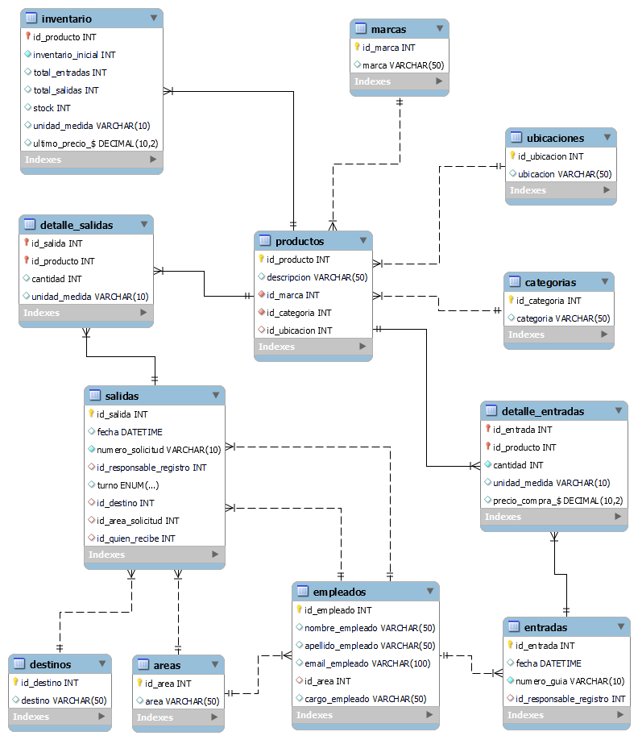

<center>

</center>


# <center>Entrega de Proyecto Final - SQL </center>
Estudiante : Doris Marquez

Comisión : 53180

Tutora : Carla Palermo

Docente : Anderson Ocaña 

Fecha : 18-05-2024

---

## Indice

 - [Temática del Proyecto](#temática-del-proyecto)
 - [Modelo de Negocio](#modelo-de-negocio)
 - [Diagrama Entidad-Relación](#diagrama-entidad-relación)
 - [Listado de Tablas y Descripción](#listado-de-tablas-y-descripción)
 - [Estructura e Ingesta de Datos](#estructura-e-ingesta-de-datos)
 - [Objetos de la Base de Datos](#objetos-de-la-base-de-datos)
   - [Documentación de Vistas](#documentación-de-vistas)
   - [Documentación de Funciones](#documentación-de-funciones)
   - [Documentación de Triggers](#documentación-de-triggers)
   - [Documentación de Procedimientos Almacenados](#documentación-de-procedimientos-almacenados)
   - [Roles, Permisos y Usuarios](#roles-permisos-y-usuarios)
 - [Backup de la Base de Datos](#backup-de-la-base-de-datos)
 - [Herramientas y Tecnologías Usadas](#herramientas-y-tecnologías-usadas)
 - [Instrucciones para Levantar el Proyecto en CodeSpaces GitHub](#instrucciones-para-levantar-el-proyecto-en-codespaces-github)
 - [Formato de Entrega](#formato-de-entrega)

---

## Temática del Proyecto

Nuestro equipo de desarrollo está trabajando en un sistema de gestión del inventario de repuestos e insumos para una empresa dedicada al mantenimiento de maquinaria, y nos enfrentamos a la necesidad de diseñar una base de datos eficiente que pueda manejar las operaciones relacionadas con los movimientos de inventario de manera óptima.

---

## Modelo de Negocio


1. **Gestión de productos**: 

    Necesitamos una base de datos que nos permita registrar la información de todos los repuestos e insumos que se tienen en el almacén, indicando descripción, marca, categoría y ubicación, así como de los empleados involucrados en el proceso de registro de movimientos, y de los empleados que reciben los repuestos e insumos.

2. **Gestión de inventario**: 

    Es importante registar el inventario incial de cada producto al momento de ingresarlo a la base de datos y de ahí en adelante se registrarán todas las entradas y salidas. Tomando en cuenta el inventario incial, así como las entradas y salidas de cada producto, se debe calcular el stock e indicar el último precio al que fue adquirido.


3. **Gestión de entradas y salidas del almacén**: 

    De cada entrada se debe registrar la fecha, el número de guía, cantidad y costo de cada producto; y de cada salida se debe registrar fecha, número de solicitud, área de la empresa que lo solicita, destino del producto ya sea el equipo a reparar o el lugar de la empresa en que se usará. También se debe registrar al empleado que realiza el movimiento en el inventario tanto de entrada como de salida, así como la personal que recibe los productos.


4. **Registro de las ubicaciones de los productos dentro del almacén, así como también las categorias, marcas y destinos, y de las áreas de la empresa así como de los empleados**: 

    Se deben registrar las ubicaciones que conforman el área de alacenamiento, las categorías en las que se clasificarán los productos, las marcas de los productos, los lugares o equipos a los que serán destinados los productos y áreas en que se divide la empresa y los empleados.

5. **Emitir informe de inventario, valor del inventario, listado de productos, listados de las entradas y salidas del almacén**

    La base de datos debe generar un informe de inventario con todos con la informacion de todos los productos, stock inicia, el total de los productos que ingresaron y salieron del almacén, y el precio de compra. También se debe calcular el valor del inventario total y porcentual.

---

[<- volver al índice](#indice)

---

## Diagrama Entidad-Relación




---

[<- volver al índice](#indice)

---

## Listado de Tablas y Descripción

El script para la creación y definición de la base de datos se encuentra en el archivo database_structure.sql, ubicado en la carpeta structure.

A constinuación se presenta la descripción de cada una de las tablas de la base de datos.

---

**Tabla `productos`**


| Campo        | Tipo        | Null | Key | Default | Extra |
|--------------|-------------|------|-----|---------|-------|
| id_producto  | int         | NO   | PK  | NULL    |       |
| descripcion  | varchar(50) | YES  |     | NULL    |       |
| id_marca     | int         | NO   | FK  | NULL    |       |
| id_categoria | int         | NO   | FK  | NULL    |       |
| id_ubicacion | int         | YES  | FK  | 1       |       |

---

**Tabla `inventario`**


| Campo              | Tipo          | Null | Key | Default | Extra             |
|--------------------|---------------|------|-----|---------|-------------------|
| id_producto        | int           | NO   | PK  | NULL    |                   |
| inventario_inicial | int           | NO   |     | 0       |                   |
| total_entradas     | int           | YES  |     | 0       |                   |
| total_salidas      | int           | YES  |     | 0       |                   |
| stock              | int           | YES  |     | NULL    | VIRTUAL GENERATED |
| unidad_medida      | varchar(10)   | YES  |     | unidad  |                   |
| ultimo_precio_$    | decimal(10,2) | YES  |     | 0.00    |                   |

---

**Tabla `entradas`**


| Campo                   | Tipo        | Null | Key | Default   | Extra             |
|-------------------------|-------------|------|-----|-----------|-------------------|
| id_entrada              | int         | NO   | PK  | NULL      |                   |
| fecha                   | date        | YES  |     | curdate() | DEFAULT_GENERATED |
| numero_guia             | varchar(10) | NO   |     | NULL      |                   |
| id_responsable_registro | int         | YES  | FK  | 10        |                   |

---

**Tabla `detalle_entradas`**


| Campo           | Tipo          | Null | Key | Default | Extra |
|-----------------|---------------|------|-----|---------|-------|
| id_entrada      | int           | NO   | PK  | NULL    |       |
| id_producto     | int           | NO   | PK  | NULL    |       |
| cantidad        | int           | NO   |     | NULL    |       |
| unidad_medida   | varchar(10)   | YES  |     | unidad  |       |
| precio_compra_$ | decimal(10,2) | YES  |     | NULL    |       |

---

**Tabla `salidas`**


| Campo                   | Tipo                | Null | Key | Default   | Extra             |
|-------------------------|---------------------|------|-----|-----------|-------------------|
| id_salida               | int                 | NO   | PK  | NULL      |                   |
| fecha                   | date                | YES  |     | curdate() | DEFAULT_GENERATED |
| numero_solicitud        | varchar(10)         | NO   |     | NULL      |                   |
| id_responsable_registro | int                 | YES  | FK  | 10        |                   |
| turno                   | enum('dia','noche') | YES  |     | NULL      |                   |
| id_destino              | int                 | YES  | FK  | NULL      |                   |
| id_area_solicitud       | int                 | YES  | FK  | NULL      |                   |
| id_quien_recibe         | int                 | YES  | FK  | NULL      |                   |

---

**Tabla `detalle_salidas`**


| Campo         | Tipo        | Null | Key | Default | Extra |
|---------------|-------------|------|-----|---------|-------|
| id_salida     | int         | NO   | PK  | NULL    |       |
| id_producto   | int         | NO   | PK  | NULL    |       |
| cantidad      | int         | YES  |     | NULL    |       |
| unidad_medida | varchar(10) | YES  |     | unidad  |       |

---

**Tabla `categorias`**


| Campo        | Tipo        | Null | Key | Default | Extra          |
|--------------|-------------|------|-----|---------|----------------|
| id_categoria | int         | NO   | PK  | NULL    | auto_increment |
| categoria    | varchar(50) | YES  |     | NULL    |                |

---

**Tabla `areas`**

| Campo   | Tipo        | Null | Key | Default | Extra          |
|---------|-------------|------|-----|---------|----------------|
| id_area | int         | NO   | PK  | NULL    | auto_increment |
| area    | varchar(50) | YES  |     | NULL    |                |


---

**Tabla `empleados`**

| Campo             | Tipo         | Null | Key | Default | Extra          |
|-------------------|--------------|------|-----|---------|----------------|
| id_empleado       | int          | NO   | PK  | NULL    | auto_increment |
| nombre_empleado   | varchar(50)  | YES  |     | NULL    |                |
| apellido_empleado | varchar(50)  | YES  |     | NULL    |                |
| email_empleado    | varchar(100) | YES  |     | NULL    |                |
| id_area           | int          | YES  | FK  | NULL    |                |
| cargo_empleado    | varchar(50)  | YES  |     | NULL    |                |

---

**Tabla `ubicaciones`**


| Campo        | Tipo        | Null | Key | Default | Extra          |
|--------------|-------------|------|-----|---------|----------------|
| id_ubicacion | int         | NO   | PK  | NULL    | auto_increment |
| ubicacion    | varchar(50) | YES  |     | NULL    |                |

---

**Tabla `destinos`**

| Campo      | Tipo        | Null | Key | Default | Extra          |
|------------|-------------|------|-----|---------|----------------|
| id_destino | int         | NO   | PK  | NULL    | auto_increment |
| destino    | varchar(50) | YES  |     | NULL    |                |

---

**Tabla `marcas`**

| Campo    | Tipo        | Null | Key | Default | Extra          |
|----------|-------------|------|-----|---------|----------------|
| id_marca | int         | NO   | PK  | NULL    | auto_increment |
| marca    | varchar(50) | YES  |     | NULL    |                |

---

[<- volver al índice](#indice)

---


## Estructura e Ingesta de Datos

* La ingesta de datos en las tablas dimensionales: areas, categorias, ubicaciones, destinos, marcas y empleados, se realiza por medio del archivo population.sql que se encuentra en la carpeta structure.
* La ingesta de datos de las tablas productos e inicio de la tabla inventario para cada producto ingresado se realiza por medio del procedimiento sp_1_insertar_producto.
* La ingesta de datos en las tablas entradas y detalle_entradas se realiza por medio del procedimiento sp_2_registrar_entrada.
* La ingesta de datos en las tablas salidas y detalle_salidas se realiza por medio del procedimiento sp_3_registrar_salida.

Dichos procedimientos se encuentran en el archivo c_stored_procedures.sql en la carpeta objects.

---


[<- volver al índice](#indice)

---

## Objetos de la Base de Datos

Los objetos de la base de dajos se encuentran en la carpeta objects, con un archivo sql para cada tipo de objeto, a saber:
- Funciones : a_funtions.sql
- Triggers : b_triggers.sql
- Prodecimientos almacenados : c_stored_procedures.sql
- Vistas : d_views.sql
- Roles, permisos y usuarios : e_roles_users.sql 

A continuación, se desarrolla la documentación de cada uno de ellos.

---

### Documentación de Vistas

---

### Listado de Vistas

* Vista 1 :  vw_1_informe_inventario
* Vista 2 :  vw_2_valor_inventario
* Vista 3 :  vw_3_valor_total_inventario
* Vista 4 :  vw_4_productos_inventario
* Vista 5 :  vw_5_entradas_productos
* Vista 6 :  vw_6_salidas_productos

---

### Vista 1 :  `vw_1_informe_inventario`

**Descripción:** 

Esta vista muestra la informacion de todos los productos del inventario, agregando además datos de las tablas productos, marca y categoria para mayor claridad de quien recibe el informe.


**Columnas:**

| Columna            | Descripción                                            | Origen           |
|--------------------|--------------------------------------------------------|------------------|
| id_producto        | id del producto                                        | tabla inventario |
| descripcion        | descripción del producto                               | tabla productos  |
| marca              | marca del producto                                     | tabla marcas     |
| categoria          | categoria del producto                                 | tabla categorias |
| inventario_inicial | cantidad de productos al iniciar el inventario         | tabla inventario |
| total_entradas     | cantidad total de productos que entraron al inventario | tabla inventario |
| total_salidas      | cantidad total de productos que salieron al inventario | tabla inventario |
| stock              | cantidad de artículos disponibles                      | tabla inventario |
| ultimo_precio_$    | último precio del producto registrado                  | tabla inventario |


**Ejemplo de consulta:** 

```sql
SELECT * 
FROM control_inventario.vw_1_informe_inventario;
```

**Muestra del resultado de la consulta:**


---

### Vista 2 :  `vw_2_valor_inventario`

**Descripción:** 

Esta vista muestra el valor del inventario y el porcentaje que corresponde a cada porducto ordenado en forma descendente.

**Columnas:**

| Columna                     | Descripción                                                                                                                                                                                                                                                            | Origen                      |
|-----------------------------|------------------------------------------------------------------------------------------------------------------------------------------------------------------------------------------------------------------------------------------------------------------------|-----------------------------|
| id_producto                 | id del producto                                                                                                                                                                                                                                                        | tabla inventario            |
| descripcion                 | descripción del producto                                                                                                                                                                                                                                               | tabla productos             |
| stock                       | cantidad de artículos disponibles                                                                                                                                                                                                                                      | tabla inventario            |
| ultimo_precio_$             |  último precio registrado del producto                                                                                                                                                                                                                                   | tabla inventario            |
| valor_inventario            | campo calculado según la fórmula: valor_inventario = stock * ultimo_precio_$                                                                                                                                                                                           | campo calculado en la vista |
| porcentaje_valor_inventario | corresponde al porcentaje que cada artículo aporta al total del valor del inventario. Se calcula por la formula: % valor inventario = valor_inventario / valor total del inventario  | campo calculado en la vista. El valor total del inventario se calcula en la función fn_4_valor_total_inventario() |


**Ejemplo de consulta:**

```sql
SELECT * 
FROM control_inventario.vw_2_valor_inventario;

```

**Muestra del resultado de la consulta:**


---


### Vista 3 :  `vw_3_valor_total_inventario`

**Descripción:** 

Esta vista muestra el valor total del inventario.

**Columnas:**

| Columna                | Descripción                                                                                | Origen                                                                                |
|------------------------|--------------------------------------------------------------------------------------------|---------------------------------------------------------------------------------------|
| valor_total_inventario | se calcula por medio de la función SUM de la siguiente forma: SUM(stock * ultimo_precio_$) | campo calculado en la vista. Los valores de stock y ultimo_precio_$ provienen de la tabla inventario |

**Ejemplo de consulta:**

```sql
SELECT * 
FROM control_inventario.vw_3_valor_total_inventario;
```
**Muestra del resultado de la consulta:**


---

### Vista 4 :  `vw_4_productos_inventario`

**Descripción:** 

Esta vista muestra todos los productos del inventario, incluyendo descripción, marca, categoría, ubicación y stock.

**Columnas:**

| Columna     | Descripción                               | Origen            |
|-------------|-------------------------------------------|-------------------|
| id_producto | id del producto                           | tabla inventario  |
| descripcion | descripción del producto                  | tabla productos   |
| marca       | marca del producto                        | tabla marcas      |
| categoria   | categoría del producto                    | tabla categorias  |
| ubicacion   | ubicación del producto dentro del almacén | tabla ubicaciones |
| stock       | cantidad de artículos disponibles         | tabla inventario  |


**Ejemplo de consulta:**

```sql
SELECT * 
FROM control_inventario.vw_4_productos_inventario;
```

**Muestra del resultado de la consulta:**


---

### Vista 5 :  `vw_5_entradas_productos`

**Descripción:** 

Esta vista muestra el registro de todas las entradas de productos al almacén.

**Columnas:**

| Columna     | Descripción                                         | Origen                 |
|-------------|-----------------------------------------------------|------------------------|
| id_entrada  | id del registro de entrada de productos             | tabla entradas         |
| fecha       | fecha en la que se registra la entrada de productos | tabla entradas         |
| id_producto | id del producto                                     | tabla detalle_entradas |
| descripcion | descripción del producto                            | tabla productos        |
| cantidad    | cantidad de productos que ingresaron                | tabla detalle_entradas |


**Ejemplo de consulta:**

```sql
SELECT * 
FROM control_inventario.vw_5_entradas_productos;
```

**Muestra del resultado de la consulta:**


---

### Vista 6 :  `vw_6_salidas_productos`

**Descripción:**

Esta vista muestra el registro de todas las salidas de productos del almacén.

**Columnas:**


| Columna     | Descripción                                        | Origen                |
|-------------|----------------------------------------------------|-----------------------|
| id_salida   | id del registro de salida de productos             | tabla salidas         |
| fecha       | fecha en la que se registra la salida de productos | tabla salidas         |
| id_producto | id del producto                                    | tabla detalle_salidas |
| descripcion | descripción del producto                           | tabla productos       |
| cantidad    | cantidad de productos que salieron                 | tabla detalle_salidas |


**Ejemplo de consulta:**

```sql
SELECT * 
FROM control_inventario.vw_6_salidas_productos;
```

**Muestra del resultado de la consulta:**


---

[<- volver al índice](#indice)

---


### Documentación de Funciones 

---

### Listado de funciones

* Función 1 : fn_1_total_entradas
* Función 2 : fn_2_total_salidas
* Función 3 : fn_3_actualizar_ultimo_precio
* Función 4 : fn_4_valor_total_inventario

---

### Función 1 : `fn_1_total_entradas`

**Descripción:** 

Esta función permite obtener la cantidad total de unidades de un producto que han ingresado al almacén. Se calcula sumando todas las entradas registradas en la tabla detalle_entradas. 

Esta función es llamada en el trigger tr_actualizar_total_entradas.


**Parámetros:**


| Parámetro     | Descripción                               | 
|-------------|-------------------------------------------|
| id_prod | id del producto tipo INT                         | 


**Retorno:**

Valor entero con el resultado de la suma de todas las cantidades del producto identificado con el parámetro en la tabla detalle_entradas.

**Ejemplo de uso:**
Para el caso del id de producto 1, la consulta sería la siguiente:

```sql
SELECT fn_1_total_entradas(1);
```

**Muestra del resultado de la consulta:**


---

### Función 2 : `fn_2_total_salidas`

**Descripción:** 

Esta función permite obtener la cantidad total de unidades de un producto que han salido del almacén. Se calcula sumando todas las salidas registradas en la tabla detalle_salidas. 

Esta función es llamada en el trigger tr_actualizar_total_salidas.


**Parámetros:**


| Parámetro     | Descripción                               | 
|-------------|-------------------------------------------|
| id_prod | id del producto tipo INT                         | 

**Retorno:**

Valor entero con el resultado de la suma de todas las cantidades del producto identificado con el parámetro en la tabla detalle_salidas.

**Ejemplo de uso:**
Para el caso del id de producto 1, la consulta sería la siguiente:

```sql
SELECT fn_2_total_salidas(1);
```

**Muestra del resultado de la consulta:**


---

### Función 3 : `fn_3_actualizar_ultimo_precio`

**Descripción:** 

Esta función permite actualizar el valor del último precio de un producto en la tabla inventario cuando se ingresa una entrada. 

Esta función es llamada por el trigger tr_actualizar_ultimo_precio.


**Parámetros:**

| Parámetro     | Descripción                               | 
|-------------|-------------------------------------------|
| id_prod | id del producto tipo INT                         | 

**Retorno:**

Esta función retorna el precio del producto indicado como parámetro, el cual corresponde al registro de entrada más reciente.

**Ejemplo de uso:**
Para el caso del id de producto 1, la consulta sería la siguiente:

```sql
SELECT fn_3_actualizar_ultimo_precio(1);
```

**Muestra del resultado de la consulta:**


---

### Función 4 : `fn_4_valor_total_inventario`

**Descripción:** 

Esta función premite obtener el valor total del inventario. Para lo cual multiplica el stock y el precio de cada producto y los suma.

Esta función es llamada en la vista vw_2_valor_inventario.

**Parámetros:**

Esta función no requiere parámetros.

**Retorno:**

Retorna el resulato del cálculo del valor total del inventario.

**Ejemplo de uso:**

```sql
SELECT fn_4_valor_total_inventario();
```

**Muestra del resultado de la consulta:**


---

[<- volver al índice](#indice)

---

### Documentación de Triggers 

---

### Listado de triggers

* Trigger 1 : tr_actualizar_total_entradas
* Trigger 2 : tr_actualizar_total_salidas
* Trigger 3 : tr_actualizar_ultimo_precio

---

### Trigger 1 : `tr_actualizar_total_entradas`

**Descripción:** 

Este trigger se ejecuta después que se inserta un registro en la tabla detalle_entradas actualizando el campo total_entradas en la tabla inventario por medio de la función fn_1_total_entradas.

**Detalles:**

* **Tabla afectada:** detalle_entradas
* **Acción:** INSERT
* **Información registrada:** valor actualizado de total_entradas en tabla inventarios

**Ejemplo:**

* Se inserta una nueva entrada en la tabla detalle_entradas.
* El trigger calcula el nuevo valor del campo total_entradas mediante la funcion fn_1_total_entradas para el id correspondiente y actualiza la tabla inventario. 

---

### Trigger 2 : `tr_actualizar_total_salidas`

**Descripción:** 

Este trigger se ejecuta después que se inserta un registro en la tabla detalle_salidas actualizando el camapo total_salidas en la tabla inventario por medio de la función fn_2_total_salidas.

**Detalles:**

* **Tabla afectada:** detalle_salidas
* **Acción:** INSERT
* **Información registrada:** valor actualizado de total_salidas en tabla inventarios

**Ejemplo:**

* Se inserta una nueva salida en la tabla detalle_salidas.
* El trigger calcula el nuevo valor del campo total_salidas mediante la funcion fn_2_total_salidas para el id correspondiente y actualiza la tabla inventario. 

---

### Trigger 3 : `tr_actualizar_ultimo_precio`

**Descripción:** 

Este trigger se ejecuta después que se inserta un registro en la tabla detalle_entradas actualizando el campo ultimo_precio_$ en la tabla inventario por medio de la función fn_3_actualizar_ultimo_precio.

**Detalles:**

* **Tabla afectada:** detalle_entradas
* **Acción:** INSERT
* **Información registrada:** valor actualizado de ultimo_precio_$ en tabla inventarios

**Ejemplo:**

* Se inserta una nueva entrada en la tabla detalle_entradas.
* El trigger calcula el nuevo valor del campo ultimo_precio_$ mediante la funcion fn_3_actualizar_ultimo_precio para el id correspondiente y actualiza la tabla inventario. 


---


[<- volver al índice](#indice)

---

### Documentación de Procedimientos Almacenados

---

### Listado de procedimientos almacenados

* Procedimiento 1 : sp_1_insertar_producto
* Procedimiento 2 : sp_2_registrar_entrada
* Procedimiento 3 : sp_3_registrar_salida

---

### Procedimiento 1 : `sp_1_insertar_producto`

**Descripción:** 

Este procedimiento permite insertar un nuevo producto en la tabla productos e inciar el inventario del mismo en la tabla inventario.

Este procedimiento es usado para el llenado de las tablas productos e inicar el inventario de los mismos, y se encuentra en el archivo c_stored_procedures.sql.

**Parámetros:**


| Parámetro          | Descripción                                    | Tipo de parámetro |
|--------------------|------------------------------------------------|-------------------|
| id_producto        | id del producto                                | entrada           |
| descripcion        | descripcián del producto                       | entrada           |
| id_marca           | id de la marca del producto                    | entrada           |
| id_categoria       | id de la categoria del producto                | entrada           |
| id_ubicacion       | id de la ubicacion del producto                | entrada           |
| inventario_inicial | cantidad de productos al iniciar el inventario | entrada           |


**Retorno:**

* Al llamar al procedimiento se ingresa un nuevo registro en la tabla productos y en la tabla inventario para el producto con el id indicado.

**Ejemplo de uso:**

```sql
CALL sp_1_insertar_producto(1, 'descripción_producto_1', 4, 2, 1, 190);
```


| Parámetro          | Valor ejemplo             |
|--------------------|---------------------------|
| id_producto        | 1                         |
| descripcion        |  'descripción_producto_1' |
| id_marca           | 4                         |
| id_categoria       | 2                         |
| id_ubicacion       | 1                         |
| inventario_inicial | 190                       |

---

### Procedimiento 2 : `sp_2_registrar_entrada`

**Descripción:** 

Este procedimiento permite registrar las entradas de productos en la tabla entradas y así con los detalles de las mismas en la tabla detalle_entradas.

Este procedimiento es usado para el llenado de las tablas entradas y detalle_entradas, y se encuentra en el archivo c_stored_procedures.sql.

Este procedimiento está diseñado para ingresar 3 productos por cada entrada.

**Parámetros:**

| Parámetro                | Descripción                                                 | Tipo de parámetro |
|--------------------------|-------------------------------------------------------------|-------------------|
| id_entrada               | id del registro de entrada de productos                     | entrada           |
| numero_guia              | número de guía recibida con los productos                   | entrada           |
| id_responsable_registro  | id del responsible de registrar el ingreso de los productos | entrada           |
| id_producto_a            | id del primer producto                                      | entrada           |
| cantidad_a               | cantidad de productos a ingresar del primer producto        | entrada           |
| precio_compra_$_a        | precio de compra del primer producto                        | entrada           |
| id_producto_b            | id del segund producto                                      | entrada           |
| cantidad_b               | cantidad de productos a ingresar del segundo producto       | entrada           |
| precio_compra_$_b        | precio de compra del segundo producto                       | entrada           |
| id_producto_c            | id del tercer producto                                      | entrada           |
| cantidad_c               | cantidad de productos a ingresar del tercer producto        | entrada           |
| precio_compra_$_c        | precio de compra del tercer producto                        | entrada           |


**Retorno:**

* Se crea un nuevo registro en la tabla entradas y 3 registros en la tabla detalle_entradas.

**Ejemplo de uso:**

```sql
CALL sp_2_registrar_entrada( 1, 'G-1', 10, 1, 16, 8, 4, 15, 46, 6, 16, 13 );
```

| Parámetro                | Valores ejemplo |
|--------------------------|-----------------|
| id_entrada               | 1               |
| numero_guia              | 'G-1'           |
| id_responsable_registro  | 10              |
| id_producto_a            | 1               |
| cantidad_a               | 16              |
| precio_compra_$_a        | 8               |
| id_producto_b            | 4               |
| cantidad_b               | 15              |
| precio_compra_$_b        | 46              |
| id_producto_c            | 6               |
| cantidad_c               | 16              |
| precio_compra_$_c        | 13              |

---

### Procedimiento 3 : `sp_3_registrar_salida`

**Descripción:** 

Este procedimiento permite registrar las salidas de productos en la tabla salidas y así con los detalles de las mismas en la tabla detalle_salidas.

Este procedimiento es usado para el llenado de las tablas salidas y detalle_salidas, y se encuentra en el archivo c_stored_procedures.sql.

Este procedimiento está diseñado para ingresar 3 productos por cada salida.


**Parámetros:**

| Parámetro               | Descripción                                                    | Tipo de parámetro |
|-------------------------|----------------------------------------------------------------|-------------------|
| id_salida               | id del registro de salida de productos                         | entrada           |
| numero_solicitud        | número de solicitud de productos recibida en el almacén        | entrada           |
| id_responsable_registro | id del responsible de registrar la salida de los productos     | entrada           |
| turno                   | turno en el que se entregaron los productos (dia, noche)       | entrada           |
| id_destino              | id del lugar o equipo al que se destina el producto solicitado | entrada           |
| id_area_solicitud       | id del area que hace la solicitud de los productos             | entrada           |
| id_quien_recibe         | id del empleado que recibe los productos                       | entrada           |
| id_producto_a           | id del primer producto                                         | entrada           |
| cantidad_a              | cantidad de productos solicitados del primer producto          | entrada           |
| id_producto_b           | id del segundo producto                                        | entrada           |
| cantidad_b              | cantidad de productos solicitados del segundo producto         | entrada           |
| id_producto_c           | id del tercer producto                                         | entrada           |
| cantidad_c              | cantidad de productos solicitados del tercer producto          | entrada           |


**Retorno:**

* Se crea un nuevo registro en la tabla salidas y 3 registros en la tabla detalle_salidas.

**Ejemplo de uso:**

```sql
CALL sp_3_registrar_salida(1, 'S-1', 10, 'dia', 18, 4, 6, 1, 7, 4, 8, 6, 9 );
```


| Parámetro               | Valor ejemplo |
|-------------------------|---------------|
| id_salida               | 1             |
| numero_solicitud        | 'S-1'         |
| id_responsable_registro | 10            |
| turno                   | 1             |
| id_destino              | 18            |
| id_area_solicitud       | 4             |
| id_quien_recibe         | 6             |
| id_producto_a           | 1             |
| cantidad_a              | 7             |
| id_producto_b           | 4             |
| cantidad_b              | 8             |
| id_producto_c           | 6             |
| cantidad_c              | 9             |

---


[<- volver al índice](#indice)

---

## Roles, Permisos y Usuarios


Se generaron tres roles:

1. `role_gerencia_administracion`: Este rol tiene permisos solo para leer las vistas.
2. `role_jefe_almacen`: Este rol tiene permisos para generar CRUD en toda la base de datos.
3. `role_encargado_almacen`: Este rol tiene permisos para leer, ingresar y actualizar la tabla prodcutos, la columna inventario_inicial de la tabla inventario, y las tablas entradas, detalle_entradas, salidas y detalle_salidas.

Además, tomando en cuenta la tabla empleados, se crearon dos usuarios con el primer rol, el usuario del jefe de almacén con el segundo rol y cuatro usuarios para los encargados de almacén con el tercer rol.

Todos los roles, permisos y usuarios se definen en el archivo e_roles_users.sql.

A constinuación, se muestra parte de las pruebas de conexión realizadas:

**Prueba de la conexión para el gerente:**


**Prueba de la conexión para el jefe de almacén:**


**Prueba de la conexión para uno de los encargados de almacén:**


---

[<- volver al índice](#indice)

---

## Backup de la Base de Datos

El backup generado es del tipo self-contained file y contiene estructura y datos. Los backups se almacenan en la carpeta backup.

También se puede generar un backup a través del comando `make backup-db` que permite ejecutar un backup de manera manual.


---

[<- volver al índice](#indice)

---

## Herramientas y Tecnologías Usadas
* MySQL (motor de bases de datos, version 8.0.36)
* MySQL Workbench (interfaz gráfica, version 8.0.36)
* Microsoft Word, Excel, PowerPoint
* Visual Studio Code (para desarrollar el documento README.md)
* Google Drive y Zoom (para ver el contenido de las clases)
* https://mockaroo.com/ (para generar datos ficticios)
* https://www.tablesgenerator.com/ (para transformar tablas de formato csv a markdown)
* Makefile (para generar una interfaz sencilla de procesos)
* Docker (para generar un container)
* GitHub (para entregar el proyecto)

---

[<- volver al índice](#indice)

---

## Instrucciones para Levantar el Proyecto en CodeSpaces GitHub

* env : archivo con contraseñas y data secretas
* Makefile : abstracción de creacción del proyecto
* docker-compose.yml : permite generar las bases de datos en forma de contenedores

### Pasos para arrancar el proyecto

* En la terminal de linux escribir :
    - `make` _si da un error de que no conexion al socket, volver al correr el comando `make`_
    - `make clean-db` limpia la base de datos
    - `make test-db` para observar los datos de cada tabla
    - `make backup-db` para realizar un backup de la base de datos
    - `make access-db` para acceder a la base de datos

---

[<- volver al índice](#indice)

---

## Formato de Entrega 

El proyecto final de la base de datos control_inventario se entraga por medio de un link a un repositorio GitHub (https://github.com/DorisMarquez/coderhouse_sql_entrega_final), el cual está conformado por las siguientes subcarpetas y archivos:

repositorio : coderhouse_sql_entrega_final
    
    subcarpeta backup :
        2024-05-18_backup_01.sql

    subcarpeta images :
        conexion-encargado-10.png
        conexion-gerente.png
        conexion-jefe-almacen.png
        DER.png
        funcion_1.png
        funcion_2.png
        funcion_3.png
        funcion_4.png
        vista_1.png
        vista_2.png
        vista_3.png
        vista_4.png
        vista_5.png
        vista_6.png

    subcarpeta objects :
        a_functions.sql
        b_triggers.sql
        c_stored_procedures.sql
        d_views.sql
        e_roles_users.sql    
    
    subcarpeta structure :
        database_structure.sql
        population.sql

    docker-compose.yml
    env.txt
    Makefile.txt
    README.md
    wait_docker.sh

---

[<- volver al índice](#indice)

---


